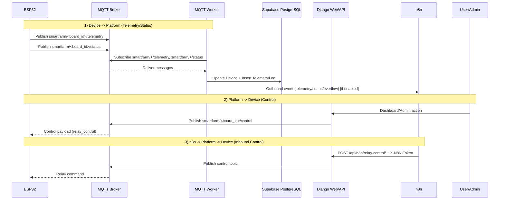

# Smart Farm AIoT Dashboard (Django + MQTT + N8N)

โปรเจกต์นี้คือระบบ Smart Farm แบบ Full Stack ที่ใช้ Django เป็นศูนย์กลางในการ
- รับข้อมูล Telemetry จาก ESP32 ผ่าน MQTT
- แสดงผล Dashboard และ Admin
- สั่งงาน Relay กลับไปที่อุปกรณ์
- เชื่อมต่อ n8n ทั้งขาออก (event notifications) และขาเข้า (inbound relay control)

สถานะปัจจุบัน (อัปเดตล่าสุด)
- Database: Supabase PostgreSQL (ปิด SQLite fallback แล้ว)
- Production target: Render Web Service + (แนะนำ) Render Worker Service
- รองรับโหมด Single Service (Web + MQTT ในโปรเซสเดียว) ด้วย `RUN_MQTT_IN_WEBSERVICE=True`

---

## 0) Clone และติดตั้งสภาพแวดล้อมสำหรับ Local Server

หัวข้อนี้คือขั้นตอนเริ่มต้นแบบเรียงลำดับ สำหรับรันในเครื่องตัวเองได้ทันที

### 0.1 สิ่งที่ต้องมีในเครื่อง

- Python 3.10+ (แนะนำ 3.11 หรือสูงกว่า)
- Git
- อินเทอร์เน็ตสำหรับติดตั้ง dependencies
- Supabase project พร้อม PostgreSQL connection string

ตรวจสอบเวอร์ชัน

```bash
python --version
pip --version
git --version
```

### 0.2 Clone โปรเจกต์

```bash
git clone https://github.com/thaitechzone/myAPP-Django-AIOTs.git
cd myAPP-Django-AIOTs
```

### 0.3 สร้างและเปิด virtual environment

CMD (Windows)

```bat
python -m venv venv
venv\Scripts\activate.bat
```

### 0.4 ติดตั้ง dependencies

```bash
pip install -r requirements.txt
```

### 0.5 สร้างไฟล์ .env สำหรับ local

สร้างไฟล์ `.env` ที่ root ของโปรเจกต์ แล้วใส่ค่าขั้นต่ำดังนี้

```env
SECRET_KEY=change-this-to-a-random-secret
DEBUG=True
ALLOWED_HOSTS=127.0.0.1,localhost
CSRF_TRUSTED_ORIGINS=

DATABASE_URL=postgresql://<user>:<password>@aws-1-ap-southeast-2.pooler.supabase.com:5432/postgres
DB_CONN_MAX_AGE=0
DB_SSLMODE=require

DJANGO_SETTINGS_MODULE=myproject.settings

# Local mode (แนะนำให้รัน worker แยก)
RUN_MQTT_IN_WEBSERVICE=False

# MQTT defaults (แก้ได้ใน Admin ภายหลัง)
MQTT_BROKER=broker.hivemq.com
MQTT_PORT=1883
MQTT_USER=
MQTT_PASSWORD=
```

หมายเหตุสำคัญ
- โปรเจกต์นี้ไม่รองรับ SQLite แล้ว ต้องมี `DATABASE_URL` เป็น PostgreSQL เท่านั้น
- หากใช้ Supabase pooler แนะนำ `DB_CONN_MAX_AGE=0`

### 0.6 รัน migration และสร้าง admin

```bash
python manage.py migrate
python manage.py createsuperuser
```

### 0.7 รันระบบแบบ Local (แนะนำ)

Terminal 1: รันเว็บ

```bash
python manage.py runserver
```

Terminal 2: รัน MQTT worker

```bash
python manage.py run_mqtt_worker
```

### 0.7.1 รันพร้อมกันแบบ 2 หน้าต่าง CMD (แนะนำที่สุด)

หน้าต่างที่ 1

```bat
cd myAPP-Django-AIOTs
venv\Scripts\activate.bat
python manage.py runserver
```

หน้าต่างที่ 2

```bat
cd myAPP-Django-AIOTs
venv\Scripts\activate.bat
python manage.py run_mqtt_worker
```

ข้อดี
- ดู log web และ worker แยกกันชัดเจน
- debug ง่าย และ restart แยก process ได้

### 0.7.2 รันพร้อมกันด้วยคำสั่งเดียว (CMD)

กรณีอยากเปิดทีเดียว 2 หน้าต่างอัตโนมัติ ให้รันจาก CMD ในโฟลเดอร์โปรเจกต์:

```bat
start "Django Web" cmd /k "venv\Scripts\activate.bat && python manage.py runserver"
start "MQTT Worker" cmd /k "venv\Scripts\activate.bat && python manage.py run_mqtt_worker"
```

หมายเหตุ
- ใช้โหมดนี้เมื่อ `.env` ตั้ง `RUN_MQTT_IN_WEBSERVICE=False`
- หากจะหยุดระบบ ให้ปิดทั้งสองหน้าต่าง CMD

URLs ที่ใช้บ่อย
- Web: http://127.0.0.1:8000/
- Admin: http://127.0.0.1:8000/admin/

### 0.8 ทางเลือก: รันแบบ Single Process

ถ้าต้องการให้ web process สตาร์ต worker ให้เอง (เหมาะทดสอบเร็ว)

1. ตั้งใน `.env`

```env
RUN_MQTT_IN_WEBSERVICE=True
```

2. รันเพียงคำสั่งเดียว

```bash
python manage.py runserver
```

หมายเหตุ
- โหมดนี้ใช้ง่าย แต่เสี่ยง worker ซ้ำในบางสถานการณ์
- สำหรับงานจริง แนะนำแยก worker ตามขั้นตอน 0.7

### 0.9 เช็กรันสำเร็จแบบเร็ว

```bash
python manage.py check
```

สิ่งที่ควรตรวจ
- เปิดหน้าเว็บและหน้า admin ได้
- worker log ขึ้นว่าเชื่อม MQTT broker สำเร็จ
- เพิ่ม Device ใน admin แล้วส่ง telemetry test ได้

---

## 1) ภาพรวมการสร้างโปรเจกต์และโครงสร้างระบบทั้งหมด

### 1.1 แนวคิดสถาปัตยกรรม

องค์ประกอบหลักมี 4 ส่วน

1. Django Web Layer
- หน้าเว็บ Landing
- API สำหรับ Dashboard และ Relay Control
- Django Admin สำหรับตั้งค่า/มอนิเตอร์ระบบ

2. MQTT Worker Layer
- รับข้อความจาก topic telemetry/status
- อัปเดต Device และบันทึก TelemetryLog
- ส่ง event ต่อไป n8n (Telemetry / Device Status / Overflow alert)

3. Database Layer (Supabase PostgreSQL)
- เก็บ Device registry
- เก็บ Telemetry logs
- เก็บ MQTT Settings และ N8N Settings (singleton)

4. Automation Layer (n8n)
- Outbound: Django ส่ง event ไป n8n webhook
- Inbound: n8n เรียก API ของ Django เพื่อสั่ง relay โดยตรง

### 1.2 โครงสร้างทำงานระดับระบบ

```text
ESP32 -> MQTT Broker -> MQTT Handler (Django) -> Supabase PostgreSQL
Dashboard/Admin -> Django API -> MQTT publish -> ESP32
Django Events -> n8n webhooks
n8n -> /api/n8n/relay-control/ -> MQTT publish -> ESP32
```

ภาพรวมการไหลของระบบ (Web + ESP32 + n8n)

```mermaid
flowchart LR
  U[User / Admin] -->|Browser| W[Django Web Service<br/>Landing / Admin / API]
  N8N[n8n Workflows] -->|Inbound Control API<br/>POST /api/n8n/relay-control/| W
  W -->|Publish Control| MQ[(MQTT Broker)]
  E[ESP32 Devices] -->|Telemetry / Status| MQ
  MQ -->|Subscribe & Process| M[MQTT Worker<br/>run_mqtt_worker or in-web thread]
  M -->|Write| DB[(Supabase PostgreSQL)]
  W -->|Read/Render| DB
  M -->|Outbound Webhooks<br/>relay / telemetry / device_status| N8N
  M -->|Overflow Alert (optional)| N8N
```

ลำดับการทำงานแบบ end-to-end



อธิบายลำดับการทำงานแบบเข้าใจง่าย (สั้นๆ)

1. ESP32 ส่งข้อมูลขึ้นระบบ
- อุปกรณ์ส่ง `telemetry` และ `status` ไปที่ MQTT Broker

2. MQTT Worker รับข้อมูลและบันทึก
- Worker ฝั่ง Django รับข้อความจาก broker แล้วอัปเดต Device/TelemetryLog ลง Supabase

3. Web แสดงผลให้ผู้ใช้
- Dashboard และ Admin อ่านข้อมูลจาก Supabase เพื่อแสดงสถานะล่าสุด

4. ผู้ใช้สั่งงาน Relay กลับไปที่อุปกรณ์
- ผู้ใช้กดสั่งจากหน้าเว็บ/API แล้ว Django publish คำสั่งไป topic `.../control`
- ESP32 รับคำสั่งและเปลี่ยนสถานะ relay

5. Django ส่ง event ไป n8n (Outbound)
- เมื่อมีเหตุการณ์ เช่น telemetry/status/relay command ระบบส่ง webhook ไป n8n ได้

6. n8n สั่งงานกลับเข้าระบบได้ (Inbound)
- n8n เรียก `POST /api/n8n/relay-control/` พร้อม `X-N8N-Token`
- Django ตรวจ token แล้วส่งคำสั่งต่อไป MQTT เพื่อควบคุม ESP32

### 1.3 โครงสร้างโฟลเดอร์โปรเจกต์

```text
myproject/
  settings.py   # config ทั้งระบบ, env loader, PostgreSQL-only DB config, security/logging
  urls.py       # routing หลักของเว็บและ API

myapp/
  models.py     # Device, TelemetryLog, MQTTSettings, N8NSettings, RelayTestPanel
  views.py      # dashboard API, relay control API, n8n inbound API
  mqtt_handler.py
  n8n_service.py
  admin.py
  apps.py
  management/commands/run_mqtt_worker.py
  templates/

requirements.txt
RENDER-DEPLOYMENT.md
VPS.md
N8NTest.md
```

---

## 2) รายละเอียด MQTT และผังการทำงานของโมดูล

### 2.1 Topic architecture

Device -> Server
- `smartfarm/<board_id>/telemetry`
- `smartfarm/<board_id>/status`

Server -> Device
- `smartfarm/<board_id>/control`
  (สร้างจาก `control_topic_pattern` โดยแทนค่า `{board_id}`)

ค่าเริ่มต้น topic ถูกตั้งผ่าน MQTT Settings ใน Admin

### 2.2 MQTT payload ตัวอย่าง

Telemetry payload

```json
{
  "board_id": "ESP32-FARM-001-NATTAPHOL-PALM",
  "rssi": -65,
  "sensors": {
    "water_temp": 25.5,
    "air_temp": 30.2,
    "air_humidity": 65.0,
    "water_overflow": false,
    "water_dry": false
  },
  "relays": {
    "relay1_pump": false,
    "relay2_fan": true,
    "relay3_heater": false
  }
}
```

Status payload

```json
{
  "board_id": "ESP32-FARM-001-NATTAPHOL-PALM",
  "status": "online",
  "ip": "192.168.1.50",
  "firmware": "1.0.0"
}
```

Control payload (Django publish)

```json
{
  "command": "relay_control",
  "relays": {
    "relay1_pump": true,
    "relay2_fan": false,
    "relay3_heater": false
  }
}
```

### 2.3 ผังการทำงานของโมดูลหลัก

`myapp/apps.py`
- ตรวจ env `RUN_MQTT_IN_WEBSERVICE`
- กันการ start ซ้ำใน runserver reloader
- ไม่ start ในคำสั่ง one-off เช่น `migrate`, `collectstatic`, `check`, `test`
- ถ้าผ่านเงื่อนไข จะสร้าง background thread แล้วเรียก `MQTTHandler.connect() + start()`

`myapp/mqtt_handler.py`
- `MQTTHandler.__init__`
  - โหลด `MQTTSettings` จาก DB
  - เซ็ต callbacks `on_connect` / `on_message` / `on_disconnect`
- `connect()`
  - เชื่อม broker ตามค่าจาก DB
- `on_connect()`
  - subscribe telemetry/status ตาม topic และ QoS ปัจจุบัน
- `on_message()`
  - แยกประเภท message จาก suffix topic
  - `/status` -> `handle_status_message()`
  - `/telemetry` -> `handle_telemetry_message()`
- `handle_status_message()`
  - อัปเดต Device ที่ลงทะเบียนแล้วเท่านั้น
  - ส่ง `device_status` event ไป n8n (ถ้าเปิด)
- `handle_telemetry_message()`
  - อัปเดต `last_seen`
  - บันทึก `TelemetryLog`
  - ส่ง `telemetry` event ไป n8n (ถ้าเปิด)
  - ถ้า `water_overflow=true` -> `trigger_n8n_alert()`
- `hot_reload_topics()`
  - ใช้เมื่อแก้ MQTT Settings ใน Admin
  - ถ้า broker/auth/keepalive เปลี่ยน -> reconnect
  - ถ้าเปลี่ยนเฉพาะ topic/QoS -> unsubscribe/subscribe ใหม่ทันที
- `publish_control_command(board_id, relay_data)`
  - สร้าง payload `relay_control`
  - publish ไป topic control ของ board_id

`myapp/n8n_service.py`
- `notify_n8n_relay_command(...)`
- `notify_n8n_telemetry(...)`
- `notify_n8n_device_status(...)`
- ทุกฟังก์ชันอ่าน flag/url/timeout จาก `N8NSettings` แล้ว `POST` ไป webhook

`myapp/views.py`
- `GET /api/dashboard/` ส่ง snapshot devices + latest telemetry
- `POST /api/control/` รับ `board_id + relays` แล้ว publish MQTT
- `POST /api/n8n/relay-control/` รับคำสั่งจาก n8n (action หรือ relays), ตรวจ token, publish MQTT

`myapp/admin.py`
- `DeviceAdmin`, `TelemetryLogAdmin`, `RelayTestPanelAdmin`
- `MQTTSettingsAdmin`
  - ปรับค่าการเชื่อมต่อ/topic ผ่าน UI
  - save แล้วพยายาม hot-reload worker ทันที
- `N8NSettingsAdmin`
  - ตั้ง outbound webhooks
  - เปิด inbound webhook และจัดการ `inbound_auth_token`

### 2.4 ข้อกำหนดสำคัญของอุปกรณ์

ระบบปัจจุบันไม่ auto-create Device
- ถ้า `board_id` ยังไม่ถูกเพิ่มใน Admin
- status/telemetry ที่เข้ามาจะถูก ignore พร้อม warning log

ดังนั้นต้องเพิ่ม Device ก่อนเริ่มรับข้อมูลจริง

---

## 3) ส่วนประกอบทั้งหมดของโปรเจกต์

### 3.1 Models

1. Device
- `board_id` (PK)
- `status` (online/offline)
- `ip_address`
- `firmware_version`
- `last_seen`

2. TelemetryLog
- `device` (FK)
- `rssi`
- `sensor_data` (JSONField)
- `relay_status` (JSONField)
- `created_at`

3. MQTTSettings (singleton, pk=1)
- `broker`, `port`, `username`, `password`
- `telemetry_topic`, `status_topic`, `control_topic_pattern`
- `keepalive`, `qos`

4. N8NSettings (singleton, pk=1)
- Outbound flags + URLs (relay/telemetry/device status)
- `enable_inbound_webhook`
- `inbound_auth_token`
- `request_timeout_seconds`

5. RelayTestPanel
- Proxy model สำหรับเมนูทดสอบ relay ใน Admin

### 3.2 API Endpoints

1. `GET /`
- Landing page

2. `GET /api/dashboard/`
- Dashboard snapshot

3. `POST /api/control/`
- Dashboard/API control ไป MQTT

4. `POST /api/n8n/relay-control/`
- n8n inbound control
- Header: `X-N8N-Token: <inbound_auth_token>`
- รองรับ payload 2 แบบ

```json
{
  "board_id": "...",
  "action": "pump_on"
}
```

```json
{
  "board_id": "...",
  "relays": {
    "relay1_pump": true
  }
}
```

### 3.3 Dependencies สำคัญ

```text
Django==6.0.3
paho-mqtt==2.1.0
requests==2.32.3
gunicorn==23.0.0
psycopg[binary]==3.2.13
whitenoise==6.9.0
```

---

## 4) การ Deploy จาก GitHub ไป Render

มี 2 โหมด
- โหมดแนะนำ: Web Service + Worker Service แยก
- โหมดทางเลือก: Single Service (`RUN_MQTT_IN_WEBSERVICE=True`)

### 4.1 ก่อน deploy

1. push โค้ดขึ้น GitHub branch ที่ต้องการ
2. เตรียม Supabase PostgreSQL URL
3. ยืนยันว่าไม่มีการใช้ sqlite URL

### 4.2 สร้าง Render Web Service

Build Command

```bash
pip install -r requirements.txt && python manage.py migrate && python manage.py collectstatic --noinput
```

Start Command

```bash
gunicorn myproject.wsgi:application --bind 0.0.0.0:$PORT
```

### 4.3 Environment Variables ขั้นต่ำที่ต้องมี

```env
SECRET_KEY=...
DEBUG=False
ALLOWED_HOSTS=myapp-django-aiots.onrender.com
CSRF_TRUSTED_ORIGINS=https://myapp-django-aiots.onrender.com
DATABASE_URL=postgresql://<user>:<password>@aws-1-ap-southeast-2.pooler.supabase.com:5432/postgres
DJANGO_SETTINGS_MODULE=myproject.settings
DB_CONN_MAX_AGE=0
```

สำหรับโหมด Single Service

```env
RUN_MQTT_IN_WEBSERVICE=True
WEB_CONCURRENCY=1
```

### 4.4 สร้าง Worker Service (แนะนำ)

Build Command

```bash
pip install -r requirements.txt && python manage.py migrate
```

Start Command

```bash
python manage.py run_mqtt_worker
```

หมายเหตุ
- โหมดนี้เสถียรกว่าใน production
- Web และ Worker ต้องใช้ `DATABASE_URL` เดียวกัน
- ทั้งสอง service ต้องชี้ไป Supabase database เดียวกัน

### 4.5 ตรวจสอบหลัง deploy

1. เปิด `/admin/` ได้
2. log ของ Web ไม่มี startup error
3. log ของ Worker ขึ้น `Connected to MQTT broker` และ subscribe topics สำเร็จ
4. ทดสอบ dashboard, relay control, telemetry ingestion, n8n webhook

---

## 5) การทดสอบ MQTT

### 5.1 เตรียมก่อนทดสอบ

1. เพิ่ม Device ใน Admin ให้ตรงกับ board_id จริง
2. ตั้งค่า MQTT Settings ให้ตรง broker/topic ที่ใช้
3. ให้ worker ทำงาน (แยก service หรือ single-service)

### 5.2 ทดสอบรับ telemetry

Topic

```text
smartfarm/ESP32-FARM-001-NATTAPHOL-PALM/telemetry
```

Payload: ใช้โครงสร้าง telemetry ตามหัวข้อ 2.2

ผลที่คาดหวัง
- มี `TelemetryLog` ใหม่ใน Admin
- `Device.last_seen` อัปเดต
- ถ้าเปิด telemetry webhook จะมี event ออกไป n8n

### 5.3 ทดสอบรับ status

Topic

```text
smartfarm/ESP32-FARM-001-NATTAPHOL-PALM/status
```

Payload มี `status`/`ip`/`firmware`

ผลที่คาดหวัง
- Device status เปลี่ยนตาม payload
- ถ้าเปิด device status webhook จะมี event ออกไป n8n

### 5.4 ทดสอบส่ง control

เรียก API

```http
POST /api/control/
```

Body ตัวอย่าง

```json
{
  "board_id": "ESP32-FARM-001-NATTAPHOL-PALM",
  "relays": {
    "relay1_pump": true,
    "relay2_fan": false,
    "relay3_heater": false
  }
}
```

ผลที่คาดหวัง
- MQTT publish ไป topic control ของ board_id
- Device รับคำสั่งและสลับสถานะ relay

---

## 6) การทดสอบ N8N

### 6.1 Outbound tests (Django -> n8n)

ตั้งค่าใน Admin > N8N Settings
- `enable_outbound_webhook` + `outbound_webhook_url`
- `enable_telemetry_webhook` + `telemetry_webhook_url`
- `enable_device_status_webhook` + `device_status_webhook_url`

ทดสอบ
1. สั่ง relay ผ่าน dashboard/admin/api
2. ส่ง telemetry/status เข้าระบบ
3. ตรวจ n8n execution ว่ารับ event ครบ 3 ประเภท

### 6.2 Inbound tests (n8n -> Django)

เงื่อนไข
1. เปิด `enable_inbound_webhook`
2. มี `inbound_auth_token`
3. เรียก endpoint ให้มี `/` ท้ายเสมอ

Endpoint

```text
https://myapp-django-aiots.onrender.com/api/n8n/relay-control/
```

Headers

```http
Content-Type: application/json
X-N8N-Token: <inbound_auth_token>
```

Payload แบบ action

```json
{
  "board_id": "ESP32-FARM-001-NATTAPHOL-PALM",
  "action": "pump_on"
}
```

Payload แบบ direct relays

```json
{
  "board_id": "ESP32-FARM-001-NATTAPHOL-PALM",
  "relays": {
    "relay1_pump": true,
    "relay2_fan": false,
    "relay3_heater": true
  }
}
```

ตัวอย่าง cURL สำหรับ import ใน n8n HTTP Request

```bash
curl -X POST "https://myapp-django-aiots.onrender.com/api/n8n/relay-control/" -H "Content-Type: application/json" -H "X-N8N-Token: YOUR_INBOUND_TOKEN" -d "{\"board_id\":\"ESP32-FARM-001-NATTAPHOL-PALM\",\"action\":\"pump_on\"}"
```

ตัวอย่างเพิ่ม (import ได้ทันที)

```bash
curl -X POST "https://myapp-django-aiots.onrender.com/api/n8n/relay-control/" -H "Content-Type: application/json" -H "X-N8N-Token: YOUR_INBOUND_TOKEN" -d "{\"board_id\":\"ESP32-FARM-001-NATTAPHOL-PALM\",\"action\":\"all_off\"}"
```

```bash
curl -X POST "https://myapp-django-aiots.onrender.com/api/n8n/relay-control/" -H "Content-Type: application/json" -H "X-N8N-Token: YOUR_INBOUND_TOKEN" -d "{\"board_id\":\"ESP32-FARM-001-NATTAPHOL-PALM\",\"relays\":{\"relay1_pump\":true,\"relay2_fan\":false,\"relay3_heater\":true}}"
```

ดูชุดตัวอย่าง cURL แบบครบทุก action/relay/fallback auth ได้ที่ `N8NTest.md`

Action ที่รองรับ
- `all_on`, `all_off`
- `pump_on`, `pump_off`
- `fan_on`, `fan_off`
- `heater_on`, `heater_off`

### 6.3 ปัญหาที่พบบ่อยในการทดสอบ n8n

1. `405 Method Not Allowed`
- มักเกิดจาก URL ขาด `/` ท้าย endpoint

2. `401 Invalid token`
- token ใน header ไม่ตรงกับ `inbound_auth_token`

3. `403 Inbound webhook is disabled`
- ยังไม่ได้เปิด `enable_inbound_webhook`

4. `400 board_id is required`
- payload ไม่มี `board_id`

5. `400 Unsupported action`
- action ไม่อยู่ในรายการที่รองรับ

---

## 7) Local Development (สรุปเร็ว)

1. สร้าง venv และติดตั้ง dependencies
2. ตั้งค่า `.env` ให้มี `DATABASE_URL` ของ Supabase
3. รัน migrate
4. สร้าง superuser
5. รันเว็บ

```bash
python manage.py runserver
```

6. รัน worker แยก (แนะนำตอน dev)

```bash
python manage.py run_mqtt_worker
```

ถ้าต้องการให้ `runserver` start worker อัตโนมัติ
- ตั้ง `RUN_MQTT_IN_WEBSERVICE=True`
- ใช้เฉพาะกรณีที่เข้าใจผลกระทบเรื่อง duplicate workers

---

## 8) Environment variables สำคัญ

ขั้นต่ำสำหรับการรัน

```env
DATABASE_URL=postgresql://<user>:<password>@aws-1-ap-southeast-2.pooler.supabase.com:5432/postgres
SECRET_KEY=...
DEBUG=False
ALLOWED_HOSTS=...
```

แนะนำสำหรับ production

```env
CSRF_TRUSTED_ORIGINS=https://...
DB_CONN_MAX_AGE=0
DB_SSLMODE=require
DJANGO_SETTINGS_MODULE=myproject.settings
WEB_CONCURRENCY=1
```

MQTT defaults (override ได้)

```env
MQTT_BROKER=broker.hivemq.com
MQTT_PORT=1883
MQTT_USER=
MQTT_PASSWORD=
```

---

## 9) เอกสารประกอบใน repo

- `SETUP-GUIDE.md`: ขั้นตอนติดตั้งพื้นฐาน
- `QUICK-START.md`: คู่มือย่อ
- `MQTT_USAGE.md`: usage ของระบบ MQTT
- `MQTT-SETTINGS-GUIDE.md`: คู่มือตั้งค่า MQTT ผ่าน Admin
- `RENDER-DEPLOYMENT.md`: แนวทาง deploy บน Render
- `VPS.md`: คู่มือ deploy ล่าสุดแบบ step-by-step
- `N8NTest.md`: คู่มือทดสอบ n8n relay control แบบล่าสุด

---

## 10) ข้อควรระวังด้านความปลอดภัย

1. อย่า commit credentials และ token ลง repo
2. ถ้า token เคยถูกแชร์ ให้ rotate ทันที
3. ใช้ `DEBUG=False` ใน production
4. ตั้ง `ALLOWED_HOSTS` และ `CSRF_TRUSTED_ORIGINS` ให้ถูกต้อง
5. ใช้ HTTPS เท่านั้นสำหรับ endpoint ที่รับคำสั่งควบคุม

---

## 11) ผู้ออกแบบระบบและหลักสูตร

- หลักสูตร: Full Stack Dashboard Control & Monitoring
- ผู้ออกแบบระบบ: อ.ณัฐพล จะสูงเนิน
- LINE: thaitechzone
- โทร: 0939391546
- Facebook: https://www.facebook.com/thaitechzone
